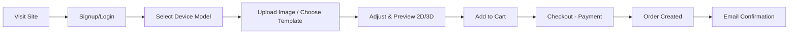
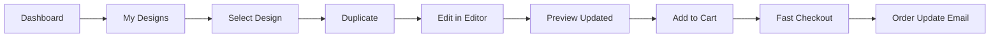
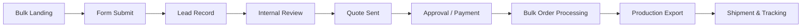
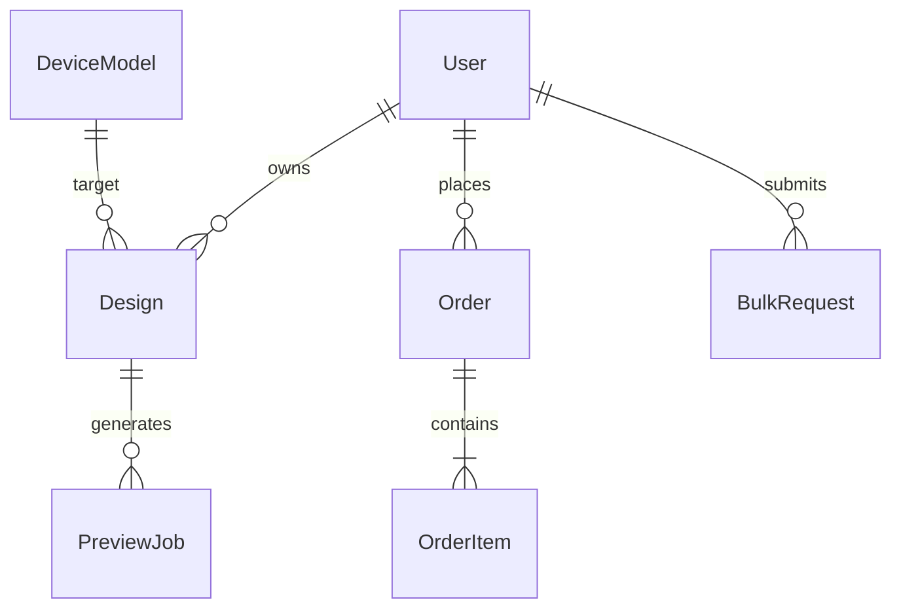

# Plalap — Concept & Implementation Plan (Tunisia)
Tagline: Custom Device Skins for Tunisia and Beyond  
Location: Tunisia  
Date: 2025-09-30  
Mission: Empowering users to personalize devices with custom designs, inspired by global leaders like Skinit.

---

## Table of Contents
1. Executive Summary  
2. Business & Market (Tunisia)  
3. MVP & Stretch Features  
4. Core User Flows  
5. System Architecture  
6. Repository Strategy & Structure  
7. Key Initialization Files (Samples)  
8. API Specification  
9. Data Model & ERD  
10. UI Libraries & Components  
11. Design Tokens  
12. Accessibility & Internationalization (i18n)  
13. Canva API Integration Approach  
14. Deployment & Infrastructure Plan  
15. Security Checklist  
16. Testing & QA Strategy  
17. Monitoring & Analytics  
18. Product Roadmap (12 Weeks)  
19. Appendices (Glossary, Packages, Commands, README Template, Ethics)

---

## 1. Executive Summary
Plalap is a Tunisia-based customization platform enabling users to design and order high-quality device skins, cases, and decals—functionally mirroring Skinit’s proven model. It targets Tunisian youth (18–35), gamers, creatives, and SMEs seeking branded assets. Users can upload artwork, use Canva-powered templates, preview in real time on phones, laptops, and consoles, and complete localized checkout in TND. The platform differentiates via trilingual UX (Arabic/French/English), local payment gateways (Flouci, Paymee, SMT integration), and regional shipping optimization. Revenue streams: direct product sales, licensed brand collaborations (pop culture, football clubs), B2B bulk orders, and affiliate/creator programs. Success metrics: CAC vs. LTV, design-to-order conversion rate, average order value (AOV), monthly active designers (MAD), and B2B repeat rate. Initial rollout focuses on MVP skin customization and reliable production/export pipeline, then expands to AR previews, AI design helpers, and marketplace for creators.

---

## 2. Business & Market (Tunisia)
### Market Context
- Tunisia’s digital economy & e-commerce adoption accelerating (mobile-first purchasing, social commerce).  
- Market drivers: smartphone penetration (~80%+), increasing personalization culture, SME branding demand.  
- Gap: Lack of localized, high-quality, on-demand device skin printing with polished UX equal to global players.

### Competitive Landscape
| Competitor | Scope | Strength | Weakness (Local Context) |
|------------|-------|----------|---------------------------|
| Skinit (Global) | Intl | Brand/licensing maturity | No local currency/logistics |
| Generic Print Shops (Local) | Local | Physical presence | Poor UX/no online preview |
| AliExpress Sellers | Global | Low cost | Long shipping, no Arabic/French UI |
| Case App / Redbubble | Global | Creator ecosystems | Currency & shipping friction |

### Differentiators
- Real-time 3D localized previews (Arabic interface).
- Canva template integration + brand packs (licensed after compliance).
- Local payment & COD (where feasible) reduces friction.
- Corporate bulk portal (pricing tiers/print-ready exports).
- Structured printing pipeline (consistent margins/bleed guidelines).

### Personas
1. “Aya” (22, university student, bilingual, wants anime/art skins).  
2. “Omar” (28, startup founder wanting branded laptop skins).  
3. “Nadia” (34, marketing manager ordering bulk promotional console wraps).  
4. “Houssem” (19, gamer customizing PS5 + controller bundle).

### Localization & Language
- Default bilingual (Arabic/French), English optional toggle.
- RTL handling for Arabic (Tailwind `dir="rtl"` contexts).
- Currency: TND; fallback pricing for USD-based licensing costs (internal).

### Success Metrics (KPIs)
- Month 3: 2,000 registered users / 400 orders.  
- Design→Add-to-Cart Conversion ≥ 25%.  
- Repeat Purchase Rate ≥ 30% (Month 6).  
- B2B Share of Revenue ≥ 20% (Month 9).  
- Avg Rendering Time < 1.2s for 2D preview; < 2.5s for 3D.

---

## 3. MVP & Stretch Features
### MVP (Phase 1 – Must Mirror Skinit Core)
1. Auth (email/password + OAuth optional later).  
2. Device catalog (phones, laptops, consoles) + variant metadata.  
3. Upload image (validation, safe MIME, size).  
4. Canva template picker (pre-sized masks).  
5. Real-time 2D/3D preview (Three.js + layered canvas).  
6. Cart & localized checkout (TND, local payment).  
7. Order lifecycle (pending → processing → shipped).  
8. Email notifications (order confirmation, shipment).  
9. Corporate bulk request form (lead capture).  
10. License collection area (flagged templates requiring rights acceptance).

### Stretch Features (Phase 2+)
1. AI design suggestions (OpenAI or local model for pattern generation).  
2. AR preview (WebXR / model overlay via device camera).  
3. Creator marketplace & revenue share.  
4. Affiliate/referral tracking.  
5. Saved “Design Collections”.  
6. Dynamic colorway generator (palette swaps).  
7. Bulk CSV order import for enterprises.  
8. In-editor guidelines for print bleed & safe zones toggle.

---

## 4. Core User Flows
### Flow 1: Signup → Create Custom Skin → Order
Narrative: User registers, selects device, uploads or picks a template, adjusts design (scale/position), previews, adds to cart, completes checkout with TND payment, and receives email confirmation.



### Flow 2: Returning User Modifies Previous Design
Narrative: Authenticated user opens past design, duplicates it, applies Canva template change, generates updated preview, and reorders faster using stored shipping profile.



### Flow 3: Corporate Bulk Order Request
Narrative: Business user fills bulk form specifying quantities and device models; system creates lead entity, internal team prices and responds; upon approval, bulk order is created with discounted tier pricing.



---

## 5. System Architecture
```mermaid
graph TD
U[User Browser<br/>Next.js + Tailwind] --> FE[Next.js Frontend (Vercel)]
FE -->|REST/JSON| API[Django REST API]
FE -->|WebSockets (preview events)| PRE[Preview Service (Node)]
API --> DB[(PostgreSQL)]
API --> OBJ[(S3-Compatible Storage)]
API --> CACHE[(Redis)]
API --> QUEUE[(Worker Queue / Celery)]
QUEUE --> WRK[Node/Django Workers<br/>Print Export, Canva Jobs]
WRK --> CANVA[Canva API]
PRE --> CANVA
WRK --> PRN[Print Export Formatter<br/>(High-res PNG/PDF)]
API --> PAY[Local Payment Gateways<br/>Flouci/Paymee/SMT]
API --> SHIP[Shipping APIs / Partner]
API --> EMAIL[Email Service (SendGrid/Mailjet)]
MON[Monitoring (Sentry/Grafana)] --> API
ANL[Analytics (PostHog/Vercel)] --> FE
```

Responsibilities:
- Frontend: Rendering, i18n, 3D previews, design editor orchestration.
- Django API: Auth, CRUD (designs/orders), business logic, licensing constraints.
- Node Services: Preview pipeline, heavy image transforms, Canva job orchestration.
- Storage: Original uploads + processed exports.
- Queue/Workers: Asynchronous rendering, export, email dispatch.
- Payment/Shipping: Localized transactional integration.
- Canva: Template management + design session embedding.

---

## 6. Repository Strategy & Structure
Monorepo Justification: Small team, shared types (via TypeScript for frontend & Node workers), unified CI/CD, simplified cross-service refactors.

### Proposed Structure
```text
plalap/
  apps/
    frontend/        # Next.js app (UI, pages, i18n, design editor)
    backend/         # Django project (REST API, admin, auth, orders)
  services/
    canva-worker/    # Node service handling Canva template sync/export
    preview-service/ # Node Express/WebSocket for live previews
  packages/
    ui/              # Shared React components
    config/          # Shared ESLint, Tailwind presets
    types/           # Shared TypeScript type declarations (API contracts)
  infra/
    terraform/       # (Optional) infra as code (S3, RDS, Redis)
    github-actions/  # CI/CD workflows
  scripts/
    dev/             # Bootstrap scripts, local env setup
  docs/
    architecture/    # Diagrams, decisions (ADR)
  .github/
    workflows/       # CI YAML
  README.md
  package.json       # Monorepo root scripts (pnpm or yarn workspaces)
  pnpm-workspace.yaml
  requirements.lock  # Backend pinned deps (pip-compile)
```

---

## 7. Key Initialization Files (Samples)

### Frontend package.json
```json
{
  "name": "plalap-frontend",
  "private": true,
  "scripts": {
    "dev": "next dev",
    "build": "next build",
    "start": "next start",
    "lint": "eslint .",
    "typecheck": "tsc --noEmit"
  },
  "dependencies": {
    "next": "14.x",
    "react": "18.x",
    "react-dom": "18.x",
    "next-intl": "^3.0.0",
    "react-query": "^3.39.0",
    "three": "^0.164.0",
    "tailwindcss": "^3.4.0",
    "clsx": "^2.0.0"
  }
}
```

### Tailwind Config
```js
// apps/frontend/tailwind.config.js
module.exports = {
  content: ["./src/**/*.{js,ts,jsx,tsx}"],
  darkMode: "media",
  theme: {
    extend: {
      colors: {
        primary: "#145DA0",
        secondary: "#1C7293",
        accent: "#F1C40F",
        bg: "#F8F9FB",
        text: "#1A1A1A",
        success: "#2ECC71"
      }
    }
  },
  plugins: []
};
```

### Django requirements.txt
```
Django==5.0.3
djangorestframework==3.15.1
django-cors-headers==4.3.1
psycopg2-binary==2.9.9
Pillow==10.1.0
boto3==1.34.0
redis==5.0.1
celery==5.3.6
python-dotenv==1.0.1
drf-spectacular==0.27.2
```

### Django settings snippet
```python
# apps/backend/config/settings.py (extract)
import os
from dotenv import load_dotenv
load_dotenv()

DEBUG = os.getenv("DEBUG", "false").lower() == "true"
SECRET_KEY = os.getenv("SECRET_KEY")
ALLOWED_HOSTS = ["*"]

DATABASES = {
  "default": {
    "ENGINE": "django.db.backends.postgresql",
    "NAME": os.getenv("DB_NAME"),
    "USER": os.getenv("DB_USER"),
    "PASSWORD": os.getenv("DB_PASS"),
    "HOST": os.getenv("DB_HOST", "localhost"),
    "PORT": os.getenv("DB_PORT", "5432")
  }
}

CACHES = {
  "default": {
    "BACKEND": "django_redis.cache.RedisCache",
    "LOCATION": os.getenv("REDIS_URL", "redis://localhost:6379/0")
  }
}

AWS_STORAGE_BUCKET_NAME = os.getenv("S3_BUCKET")
CANVA_API_KEY = os.getenv("CANVA_API_KEY")
LOCAL_CURRENCY = "TND"
```

### Node Canva Worker (server.js)
```js
// services/canva-worker/server.js
import express from "express";
import fetch from "node-fetch";

const app = express();
app.use(express.json());

const CANVA_API_KEY = process.env.CANVA_API_KEY;

app.post("/export", async (req, res) => {
  const { designId, format = "PNG" } = req.body;

  // Example pseudo-call (replace with real Canva endpoints)
  const r = await fetch(`https://api.canva.com/v1/designs/${designId}/exports`, {
    method: "POST",
    headers: {
      "Authorization": `Bearer ${CANVA_API_KEY}`,
      "Content-Type": "application/json"
    },
    body: JSON.stringify({ format })
  });

  if (!r.ok) {
    return res.status(500).json({ error: "Export failed" });
  }

  const data = await r.json();
  res.json({ status: "queued", data });
});

app.listen(4002, () => console.log("Canva worker running on 4002"));
```

---

## 8. API Specification (Core)
Base URL: `/api/v1`

| Endpoint | Method | Description |
|----------|--------|-------------|
| /auth/register | POST | Create user |
| /designs | POST | Upload/create design metadata + file |
| /designs/{id}/preview | POST | Generate preview (queues job) |
| /cart | GET/POST | Get or update user cart |
| /orders | POST | Create order from cart |
| /orders/{id} | GET | Retrieve order + status |
| /bulk-requests | POST | Create corporate bulk request |
| /devices | GET | List device models |

### Sample: POST /designs
Request:
```json
{
  "deviceModelId": "iphone-15-pro",
  "name": "Galaxy Theme",
  "sourceType": "upload",
  "fileKey": "uploads/tmp/abc123.png"
}
```
Response:
```json
{
  "id": "dsg_01",
  "status": "draft",
  "previewUrl": null,
  "createdAt": "2025-09-30T10:00:00Z"
}
```

### Sample: POST /designs/{id}/preview
Request:
```json
{ "mode": "3d" }
```
Response:
```json
{
  "jobId": "prv_789",
  "status": "queued"
}
```

### Sample: POST /orders
Request:
```json
{
  "items": [
    { "designId": "dsg_01", "sku": "IPH15PRO-SKIN-MATTE", "qty": 1 }
  ],
  "shippingAddress": {
    "fullName": "Aya Ben Ali",
    "city": "Tunis",
    "country": "TN",
    "line1": "Avenue Habib Bourguiba"
  },
  "paymentMethod": "flouci"
}
```
Response:
```json
{
  "orderId": "ord_5001",
  "status": "payment_pending",
  "amount": { "value": 49.00, "currency": "TND" }
}
```

---

## 9. Data Model & ERD
Entities:
- User: id, email, password_hash, locale, role
- DeviceModel: id, vendor, modelName, category, templateMaskUrl, printableArea (json)
- Design: id, userId, deviceModelId, status, fileOriginalKey, filePreviewKey, sourceType, licenseTag
- Order: id, userId, totalAmount, status, paymentProvider, trackingCode
- OrderItem: id, orderId, designId, sku, unitPrice, quantity
- BulkRequest: id, orgName, contactEmail, notes, status, volumeEstimate
- PreviewJob: id, designId, mode, status, resultUrl



---

## 10. UI Libraries & Components
| Purpose | Library | Usage |
|---------|---------|-------|
| Headless UI | @headlessui/react | Dialogs, modals |
| Forms | react-hook-form | Design form, address form |
| Data fetching | React Query | API caching & invalidation |
| 3D Preview | Three.js | Device model + texture |
| i18n | next-intl | Locale routing & messages |
| Images | sharp (backend) | Processing & resizing |
| State (light) | Zustand | Editor state (layer positions) |
| Validation | Zod | Frontend schema validation |
| Accessibility | Radix Primitives (optional) | Focus management |

---

## 11. Design Tokens
Palette:
- Primary (#145DA0) – Brand blue (AA on #F8F9FB)  
- Secondary (#1C7293) – UI accents (AA on white)  
- Accent (#F1C40F) – Calls to action (contrast meets AA with #1A1A1A)  
- Background (#F8F9FB) – Light UI base  
- Text (#1A1A1A) – Primary text on light (AAA vs bg)  
- Success (#2ECC71) – Confirmation states  

Fonts:
- Primary Multilingual: Noto Sans Arabic
- Secondary UI/Headings: Inter

Spacing scale (example): 4, 8, 12, 16, 24, 32.

---

## 12. Accessibility & Internationalization (i18n)
Accessibility Steps:
- Semantic landmarks (header/nav/main/footer).
- ARIA labels on 3D preview canvas (role="img", alt text dynamic).
- Keyboard: Tab order in editor tools; Esc closes modals.
- High contrast toggle & force outline styles.
- Larger hit areas (min 44px).
- Live region for preview generation status.

i18n Setup:
1. Use `next-intl` with `app/(locale)/` segment.
2. Locales: ar (default), fr, en.
3. Resource separation: `/messages/{locale}.json`.
4. Right-to-left switching via `<html dir="rtl">` for Arabic.
5. Price/currency formatting using Intl API with TND.

---

## 13. Canva API Integration Approach
Workflow:
1. Admin creates template frames sized per device printable area (includes bleed).
2. User selects template → Canva design session launched (embedded).
3. On design publish: Canva webhook triggers Node canva-worker.
4. Worker requests export (PNG @ 300 DPI + vector/PDF if allowed).
5. Export stored (S3), design record updated, triggers preview job.
6. Print-ready file includes cut path overlay from DeviceModel.printableArea.

Django Example (Webhook Endpoint):
```python
@api_view(["POST"])
def canva_webhook(request):
    payload = request.data
    design_id = payload.get("designId")
    # enqueue export job
    enqueue_canva_export(design_id)
    return Response({"status": "accepted"})
```

Node Export Pseudocode:
```js
async function exportDesign(designId) {
  const res = await fetch(`https://api.canva.com/v1/designs/${designId}/exports`, {
    method: "POST",
    headers: { "Authorization": `Bearer ${process.env.CANVA_API_KEY}` },
    body: JSON.stringify({ format: "PNG", quality: 100, dpi: 300 })
  });
  return res.json();
}
```

Applying to Device Model:
- Overlay mask: multiply or clip path in preprocessing.
- Composite with safe zone lines for internal QA.

---

## 14. Deployment & Infrastructure Plan
Frontend (Next.js):
- Host: Vercel.
- Environment Vars: API_BASE_URL, NEXT_PUBLIC_I18N_LOCALES, SENTRY_DSN.
- Build command: `pnpm install && pnpm build`.

Backend (Django):
- Host: Render / AWS ECS Fargate.
- Gunicorn + auto-scale on CPU > 70%.
- File storage: S3 (minio local dev).
- Redis: Elasticache / Upstash.

Workers:
- Node workers on AWS ECS / Render background services.
- Celery for email & order finalization tasks.

CI/CD (GitHub Actions) Example:
```yaml
name: CI
on: [push]
jobs:
  build-test:
    runs-on: ubuntu-latest
    steps:
      - uses: actions/checkout@v4
      - uses: pnpm/action-setup@v2
        with: { version: 8 }
      - run: pnpm install
      - run: pnpm -F plalap-frontend build
      - name: Backend Tests
        run: |
          pip install -r apps/backend/requirements.txt
          python manage.py test
  deploy-frontend:
    needs: build-test
    runs-on: ubuntu-latest
    steps:
      - uses: amondnet/vercel-action@v25
        with:
          vercel-token: ${{ secrets.VERCEL_TOKEN }}
          working-directory: apps/frontend
```

---

## 15. Security Checklist
- Auth: JWT (short-lived) + refresh tokens (HTTP-only Secure cookies).
- Password hashing: Argon2 or PBKDF2.
- Rate limiting: Nginx / Django middleware (e.g., 100 req/5m per IP).
- Input validation: Zod (frontend), DRF serializers (backend).
- File upload scanning: MIME + size limit + optional ClamAV container.
- CSP: default-src 'self'; img CDN whitelisted; frame-src Canva domain.
- CORS: Restrict origins to production domains.
- Secrets: Stored in platform secrets manager (Vercel / AWS SSM).
- Logging PII minimization (hash email if used in analytics).
- Payment: Do not store raw card data (offload to gateway).
- Licensing: Track licenseTag field & restrict export for unlicensed usage.

---

## 16. Testing & QA Strategy
Test Layers:
- Unit: Jest (React components, utility functions) & Pytest for Django logic.
- Integration: API contract tests (orders, design creation).
- E2E: Playwright flows (signup → design → checkout).
- Performance: Lighthouse budget (First Contentful Paint < 1.5s, TTFB < 500ms).
- Load: k6 scenario for 100 concurrent preview requests.
- Visual Regression: Percy or Chromatic for editor UI deltas.

Sample Playwright Flow (Pseudo):
```js
test("full purchase flow", async ({ page }) => {
  await page.goto("/");
  await page.click("text=Sign Up");
  // ...
  await page.click("text=Add to Cart");
  await page.click("text=Checkout");
});
```

---

## 17. Monitoring & Analytics
- Error Tracking: Sentry (frontend + backend).
- Performance: OpenTelemetry export (optional future).
- Application Metrics: Prometheus/Grafana (request latency, queue depth).
- Business Metrics: PostHog (design creation funnel).
- Logging: JSON structured logs (timestamp, userId, traceId).
- Alerting: Slack webhook for error rate spikes > threshold.

---

## 18. Product Roadmap (12 Weeks)
| Sprint (2w) | Goals | Deliverables | Effort |
|-------------|-------|--------------|--------|
| 1 | Foundations | Monorepo, Auth, DeviceModel seed | Large |
| 2 | Design Core | Upload + basic preview (2D) | Large |
| 3 | Canva Embed + 3D | Canva session + Three.js texture mapping | Large |
| 4 | Checkout & Orders | Cart, payment integration (Flouci) | Medium |
| 5 | Exports & Workers | Print-ready pipeline, email events | Medium |
| 6 | Bulk & Polish | Bulk requests, localization, QA, security hardening | Medium |

Milestones:
- M3 (Week 6): Closed beta live.
- Public Launch: Post stabilization Week 8 if ahead.

Roles:
- CTO: Architecture, infra, security.
- Full-stack Dev (1–2): Features & API.
- Frontend Dev (1): Editor & preview.
- Designer: UI kit & templates.
- Ops: Deployment & monitoring setup (shared early).

---

## 19. Appendices

### A. Glossary
- “Printable Area”: Region safe for design (excludes camera holes).
- “Bleed”: Extra margin for trimming accuracy.
- “Design Session”: Canva editing instance.

### B. Recommended Packages
- Frontend: next, react-query, three, zustand, react-hook-form, zod.
- Backend: Django, DRF, Celery, boto3, Pillow.
- Workers: sharp, node-fetch, bullmq (optional).
- Testing: Jest, Playwright, Pytest.
- Security: django-cors-headers, helmet (Node).
- 3D: three, @react-three/fiber (optional).

### C. Project Skeleton Commands
```bash
mkdir plalap && cd plalap
pnpm init
pnpm add -w next react react-dom typescript
django-admin startproject backend apps/backend
mkdir -p services/canva-worker
touch services/canva-worker/server.js
```

### D. Sample README Template
```markdown
# Plalap
Custom device skins & cases for Tunisia (Skinit-like).
## Stack
Next.js, Django REST, Node workers, Canva API, PostgreSQL, Redis.
## Dev
pnpm dev (frontend), python manage.py runserver (backend), node server.js (workers).
## Env
Copy .env.example → .env. Set DB + CANVA_API_KEY.
```

### E. Ethical Considerations
- Intellectual Property: Users must confirm rights for uploaded artwork; DMCA-style takedown process.
- Licensed Content: Segregate protected brand templates; gating with licenseTag.
- User Privacy: Limit retention of raw analytics; anonymize IP addresses.
- Content Moderation: Flag disallowed imagery (later AI moderation).
- Transparency: Terms & usage guidelines localized in Arabic/French.

---

## 20. PDF Generation Instructions
Generate PDF from this Markdown:
```bash
pandoc "Plalap — Concept & Implementation Plan (Tunisia).md" \
  -o "Plalap — Concept & Implementation Plan (Tunisia).pdf" \
  --from gfm --toc --metadata title="Plalap — Concept & Implementation Plan (Tunisia)"
```

Or use:
```bash
npx @marp-team/marp-cli "Plalap — Concept & Implementation Plan (Tunisia).md" -o plan.pdf
```

---

## 21. Base64 PDF (Placeholder)
NOTE: Below is a placeholder. Generate a fresh PDF using instructions above for production accuracy.

---BEGIN BASE64 PDF---
UEhBQ0VIT0xERVI6IEdlbmVyYXRlIHBkZiBsb2NhbGx5gdKAdGVjaG5pY2FsIGNvbnRlbnQgbm90IGFjdHVhbCBmaW5hbCBkb2N1bWVudC4=
---END BASE64 PDF---

---

END OF DOCUMENT
