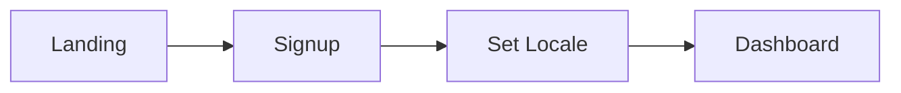
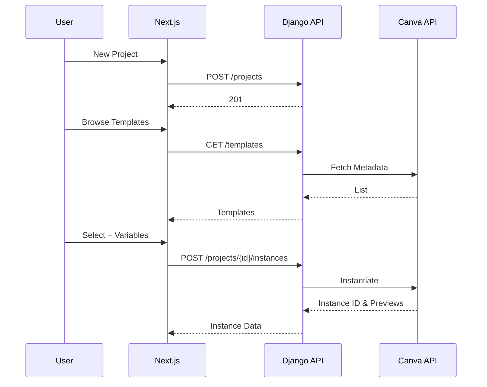
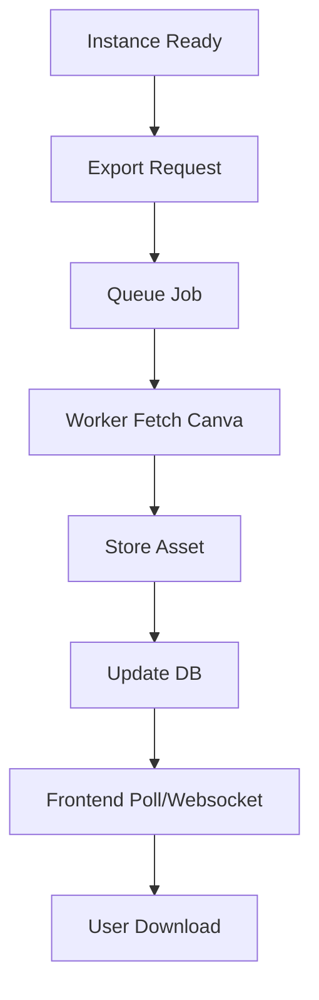
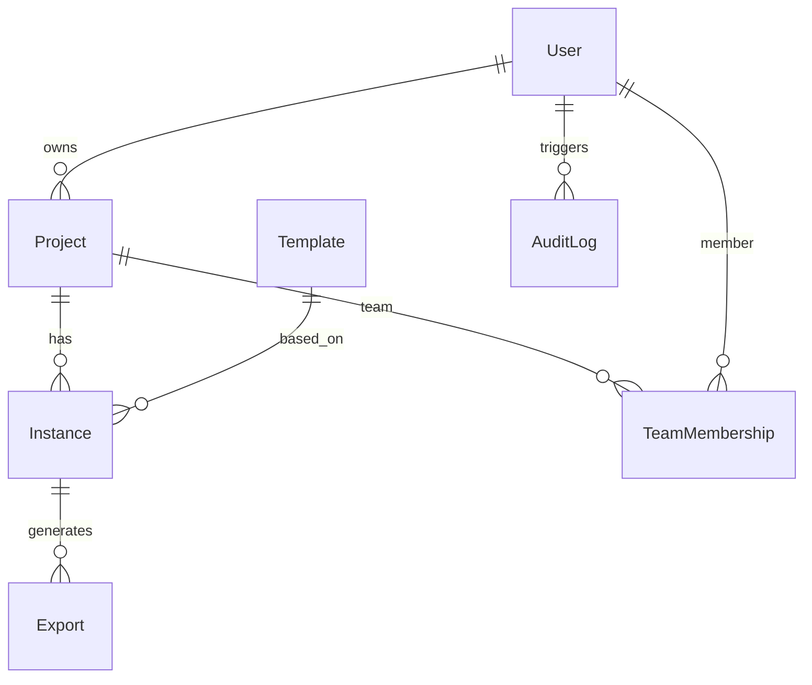

# Plalap — Concept & Implementation Plan (Tunisia)

_Tagline: Create, Localize, and Launch Engaging Visual Campaigns Fast_  
_Location: Tunisia_  
_Date: 2025-09-29_  
_Mission: Empower Tunisian creators and SMEs to rapidly design, localize, and publish multi-language visual campaigns using a streamlined web platform integrated with Canva._

---

## 1. Cover Page
- Project: Plalap  
- Tagline: Create, Localize, and Launch Engaging Visual Campaigns Fast  
- Location: Tunisia  
- Date: 2025-09-29  
- Mission Statement: Empower Tunisian creators and SMEs to rapidly design, localize, and publish multi-language visual campaigns using a streamlined Canva-integrated platform.  

---

## 2. Table of Contents
- [Plalap — Concept \& Implementation Plan (Tunisia)](#plalap--concept--implementation-plan-tunisia)
  - [1. Cover Page](#1-cover-page)
  - [2. Table of Contents](#2-table-of-contents)
  - [3. Executive Summary](#3-executive-summary)
  - [4. Business \& Market (Tunisia)](#4-business--market-tunisia)
  - [5. MVP Feature Set](#5-mvp-feature-set)
  - [6. Core User Flows](#6-core-user-flows)
    - [6.1 Signup → Dashboard](#61-signup--dashboard)
    - [6.2 Create Project → Template → Localize](#62-create-project--template--localize)
    - [6.3 Export](#63-export)
  - [7. High-Level Architecture](#7-high-level-architecture)
  - [8. Repository Approach \& Layout](#8-repository-approach--layout)
  - [9. Key File Examples](#9-key-file-examples)
    - [9.1 Frontend package.json](#91-frontend-packagejson)
    - [9.2 tailwind.config.js](#92-tailwindconfigjs)
    - [9.3 backend/requirements.txt](#93-backendrequirementstxt)
    - [9.4 backend/settings.py (Excerpt)](#94-backendsettingspy-excerpt)
    - [9.5 services/canva-worker/server.js](#95-servicescanva-workerserverjs)
  - [10. API Specification](#10-api-specification)
  - [11. Data Model / ERD](#11-data-model--erd)
  - [12. UI Libraries \& Components](#12-ui-libraries--components)
  - [13. Design Tokens](#13-design-tokens)
  - [14. Accessibility \& i18n](#14-accessibility--i18n)
  - [15. Canva API Integration](#15-canva-api-integration)
    - [15.1 Django OAuth Exchange](#151-django-oauth-exchange)
    - [15.2 Worker Polling (Pseudo)](#152-worker-polling-pseudo)
  - [16. Deployment \& Infrastructure Plan](#16-deployment--infrastructure-plan)
  - [17. Security Checklist](#17-security-checklist)
  - [18. Testing \& QA](#18-testing--qa)
  - [19. Monitoring \& Analytics](#19-monitoring--analytics)
  - [20. Roadmap (6 Weeks)](#20-roadmap-6-weeks)
  - [21. Appendices](#21-appendices)
    - [21.1 Glossary](#211-glossary)
    - [21.2 Recommended Packages](#212-recommended-packages)
    - [21.3 Project Skeleton Commands](#213-project-skeleton-commands)
    - [21.4 README Template](#214-readme-template)
- [Plalap](#plalap)
  - [Overview](#overview)
  - [Tech Stack](#tech-stack)
  - [Development](#development)
  - [Environment](#environment)
  - [Testing](#testing)
  - [Deployment](#deployment)
  - [License](#license)

---

## 3. Executive Summary
Plalap is a web platform enabling Tunisian SMBs, creators, agencies, and student entrepreneurs to design, localize, and publish branded campaign visuals rapidly. It integrates Canva’s templating capabilities with workflow guidance and Arabic/French bilingual support (English optional). The MVP focuses on project creation, template selection, localized content insertion, export, and publication tracking. Key differentiators: (1) seamless bilingual (ar/fr) management with RTL support, (2) templated marketing asset generation via Canva, (3) lightweight analytics and publishing assistance. Initial audience: small marketing teams, freelancers, NGOs, campus clubs. Value: reduces design iteration time, enforces brand consistency, simplifies multilingual adaptation. Growth: team collaboration, template marketplace, data-driven automation, external publishing APIs. Monetization: freemium (export quotas) plus paid tiers (collaboration, analytics, brand kits).

---

## 4. Business & Market (Tunisia)
- Languages: Arabic (core), French (business), English (expansion).  
- Localization: RTL UI, date (dd/MM/yyyy), currency TND, bilingual emails.  
- Pain Points: Slow bilingual asset turnaround, fragmented tools, inconsistent brand reuse.  
- Segments:  
  - Freelancers & micro-agencies  
  - SMEs (retail, NGOs, education)  
  - University/startup ecosystems  
- Competition: Native Canva use (manual localization), small local studios, ad-hoc social media managers.  
- Differentiators: Guided campaign model + structured multilingual workflow + analytics.

---

## 5. MVP Feature Set
Priorities: P0 (Critical), P1 (Important), P2 (Later)

P0: Auth (email/password, Google), Profile + locale, Project CRUD, Template catalog, Canva template instantiation, Localization variable mapping (ar/fr), Export (PNG/PDF), Dashboard recent items, Basic audit log, i18n infra, RTL support.

P1: Team invitations (Owner/Collaborator), Search/tag projects, Variant generation (multi-language set), Simple analytics (exports per language/template), Notification emails, Basic rate limiting.

P2: Scheduling exports, Social channel connectors (placeholders), Brand kits (logos/colors), Asset version diff, Webhooks stub.

Stretch (6–8):  
1. Template marketplace  
2. AI translation suggestions  
3. Bulk export queue  
4. Partner webhook API  
5. Live collaboration indicators  
6. Approval workflow (draft→approved)  
7. CSV data merge for multi-variant assets  
8. Billing & subscriptions (Stripe)

---

## 6. Core User Flows

### 6.1 Signup → Dashboard
Narrative: User registers, sets preferred language, lands on dashboard with "Create Project" CTA.



### 6.2 Create Project → Template → Localize
Narrative: User defines project, selects target languages, filters templates, inputs localized variables, previews instances.



### 6.3 Export
Narrative: User exports localized instance; job queued; worker renders; asset stored; user downloads.



---

## 7. High-Level Architecture
```mermaid
graph TD
A[Next.js (Vercel)] -->|JWT REST| B[Django API]
B --> C[(PostgreSQL)]
B --> H[(Redis Cache)]
B --> D[Redis Queue]
D --> E[Node Canva Worker]
E -->|OAuth| F[Canva API]
E --> G[(Object Storage S3/DO)]
A --> G
B --> I[Sentry / Logs]
A --> J[Analytics]
```

Responsibilities:
- Next.js: UI, SSR/ISR, i18n routing  
- Django: Auth, business logic, persistence, API  
- Node Worker: Asynchronous exports, Canva integration  
- Redis: Queue + caching  
- PostgreSQL: Core relational data  
- Object Storage: Binary assets  
- Sentry/Analytics: Monitoring and metrics  

---

## 8. Repository Approach & Layout
Monorepo chosen for: shared types, unified CI, simpler dependency governance, atomic changes.

```
plalap/
  apps/
    frontend/            # Next.js app
    backend/             # Django project
  services/
    canva-worker/        # Node export worker
  packages/
    shared-types/        # OpenAPI derived types
    ui/                  # Shared React component library
  infra/
    terraform/           # Infra as code (optional)
    github-actions/      # Reusable workflow templates
  scripts/               # Automation scripts
  docs/                  # Documentation (this file)
  .github/workflows/     # CI/CD pipelines
  package.json           # Workspace root
  pyproject.toml         # (Optional Python config)
  README.md
```

---

## 9. Key File Examples

### 9.1 Frontend package.json
```json
{
  "name": "plalap-frontend",
  "private": true,
  "scripts": {
    "dev": "next dev",
    "build": "next build",
    "start": "next start",
    "lint": "eslint . --ext .js,.ts,.tsx",
    "typecheck": "tsc --noEmit",
    "test": "vitest run"
  },
  "dependencies": {
    "next": "14.x",
    "react": "18.x",
    "react-dom": "18.x",
    "next-intl": "^3.0.0",
    "react-hook-form": "^7",
    "swr": "^2",
    "clsx": "^2",
    "axios": "^1"
  },
  "devDependencies": {
    "tailwindcss": "^3",
    "autoprefixer": "^10",
    "postcss": "^8",
    "typescript": "^5",
    "@types/node": "^20",
    "@types/react": "^18"
  }
}
```

### 9.2 tailwind.config.js
```js
module.exports = {
  darkMode: 'class',
  content: ['./pages/**/*.{js,ts,tsx}', './components/**/*.{js,ts,tsx}', '../packages/ui/**/*.{js,ts,tsx}'],
  theme: {
    extend: {
      colors: {
        primary: '#0D5D56',
        secondary: '#FFB400',
        accent: '#2F80ED',
        bg: '#F7F9FA',
        text: '#1E293B',
        success: '#18A558'
      },
      fontFamily: {
        sans: ['"Cairo"', '"Inter"', 'sans-serif'],
        ui: ['"Inter"', 'system-ui']
      }
    }
  }
}
```

### 9.3 backend/requirements.txt
```
Django==5.0.*
djangorestframework==3.15.*
psycopg[binary]==3.1.*
django-cors-headers==4.3.*
django-environ==0.11.*
redis==5.0.*
celery==5.3.*
PyJWT==2.8.*
requests==2.32.*
drf-spectacular==0.27.*
```

### 9.4 backend/settings.py (Excerpt)
```python
import environ, os
env = environ.Env()
environ.Env.read_env()

SECRET_KEY = env("DJANGO_SECRET_KEY")
DEBUG = env.bool("DEBUG", False)
ALLOWED_HOSTS = ["plalap.app", "localhost"]
CORS_ALLOWED_ORIGINS = ["https://plalap.app", "http://localhost:3000"]

DATABASES = {
  "default": {
    "ENGINE": "django.db.backends.postgresql",
    "NAME": env("DB_NAME"),
    "USER": env("DB_USER"),
    "PASSWORD": env("DB_PASSWORD"),
    "HOST": env("DB_HOST"),
    "PORT": env("DB_PORT", default="5432"),
  }
}

REDIS_URL = env("REDIS_URL")
CANVA_CLIENT_ID = env("CANVA_CLIENT_ID")
CANVA_CLIENT_SECRET = env("CANVA_CLIENT_SECRET")
CANVA_REDIRECT_URI = env("CANVA_REDIRECT_URI")
JWT_ISSUER = "plalap"
```

### 9.5 services/canva-worker/server.js
```js
import express from 'express'
import fetch from 'node-fetch'
import dotenv from 'dotenv'
dotenv.config()

const app = express()
app.use(express.json())

const CANVA_OAUTH_TOKEN_URL = 'https://api.canva.com/auth/token'
const CANVA_DESIGN_URL = 'https://api.canva.com/v1/designs'

async function getAccessToken(refreshToken) {
  const res = await fetch(CANVA_OAUTH_TOKEN_URL, {
    method: 'POST',
    headers: {'Content-Type': 'application/json'},
    body: JSON.stringify({
      client_id: process.env.CANVA_CLIENT_ID,
      client_secret: process.env.CANVA_CLIENT_SECRET,
      grant_type: 'refresh_token',
      refresh_token: refreshToken
    })
  })
  if (!res.ok) throw new Error('Token refresh failed')
  return res.json()
}

app.post('/export', async (req, res) => {
  try {
    const { designTemplateId, textMap, refreshToken } = req.body
    const tokenData = await getAccessToken(refreshToken)
    const instanceRes = await fetch(`${CANVA_DESIGN_URL}`, {
      method: 'POST',
      headers: {
        Authorization: `Bearer ${tokenData.access_token}`,
        'Content-Type': 'application/json'
      },
      body: JSON.stringify({
        template_id: designTemplateId,
        variables: textMap
      })
    })
    const instanceJson = await instanceRes.json()
    res.json({ status: 'queued', instance: instanceJson.id })
  } catch (e) {
    console.error(e)
    res.status(500).json({ error: 'Export queue failed' })
  }
})

app.listen(4001, () => console.log('Canva worker running on 4001'))
```

---

## 10. API Specification
1. POST /auth/signup  
   - Req: `{"email":"user@x.tn","password":"***","locale":"ar"}`  
   - Res: `201 {"user":{"id":1,"email":"..."}, "token":"<jwt>"}`  

2. POST /auth/login  
   - Req: `{"email":"user@x.tn","password":"***"}`  
   - Res: `200 {"token":"<jwt>","user":{"id":1,"locale":"ar"}}`  

3. GET /projects  
   - Res: `200 [{"id":10,"name":"Campaign A","languages":["ar","fr"]}]`  

4. POST /projects  
   - Req: `{"name":"Campaign A","languages":["ar","fr"],"description":"Promo Ramadan"}`  
   - Res: `201 {"id":10,"status":"draft"}`  

5. POST /projects/{id}/instances  
   - Req: `{"template_id":"tpl_123","variables":{"ar":{"headline":"مرحبا"},"fr":{"headline":"Bonjour"}}}`  
   - Res: `201 {"instance_id":"inst_456","status":"pending"}`  

6. POST /exports  
   - Req: `{"instance_id":"inst_456","format":"png"}`  
   - Res: `202 {"export_id":"exp_789","status":"queued"}`  

7. GET /exports/{export_id}  
   - Res: `200 {"status":"ready","url":"https://cdn/.../asset.png"}`  

8. GET /analytics/summary  
   - Res: `200 {"exports_per_language":{"ar":12,"fr":9}, "top_templates":[{"template_id":"tpl_123","count":5}]}`  

Auth: Bearer JWT header. Errors: `{"detail":"message","code":"ERR_CODE"}`.

---

## 11. Data Model / ERD
Entities:
- User (id, email, password_hash, locale, created_at)
- Project (id, owner_id, name, description, languages[], status, created_at)
- Template (id, canva_template_id, category, metadata)
- Instance (id, project_id, template_id, variables json, status)
- Export (id, instance_id, format, storage_url, status, created_at)
- AuditLog (id, user_id, action, entity_type, entity_id, timestamp)
- TeamMembership (id, project_id, user_id, role)



---

## 12. UI Libraries & Components
- Headless UI: dialogs, menus  
- react-hook-form: forms  
- SWR: API caching / incremental revalidation  
- clsx: conditional classes (RTL)  
- date-fns: formatting (locale)  
- zod: schema validation (shared)  
- next-intl: i18n routing + messages  
- Heroicons/Lucide: icons  

Key Components: `ProjectCard`, `LocaleSwitcher`, `TemplateGrid`, `InstanceEditor`, `ExportStatusBadge`, `TeamInviteModal`.

---

## 13. Design Tokens
Colors:
- primary: #0D5D56 (AA on light backgrounds)  
- secondary: #FFB400 (Use dark text #1E293B)  
- accent: #2F80ED (AA with white text)  
- bg: #F7F9FA  
- text: #1E293B  
- success: #18A558 (Check contrast when over bg)  

Fonts:
- Cairo (primary multilingual)  
- Inter (UI/system complement)

Spacing: Tailwind default + custom `72, 84`.  
Radii: 4px / 8px /16px.  
Shadows: 0 / subtle / elevated.

---

## 14. Accessibility & i18n
- Semantic HTML, ARIA only where needed  
- Keyboard: Tab order, `focus-visible` styles  
- Skip link at top  
- `dir="rtl"` for Arabic root `<html>`  
- Locale files: `/locales/{ar,fr,en}/*.json`  
- Directional utilities (swap padding/margin)  
- Lint rule for alt text, form labels  
- jest-axe + Playwright accessibility scans  
- Pluralization handled via i18n library  
- Keep 44x44px touch targets.

---

## 15. Canva API Integration
Flow:
1. User authorizes (OAuth).  
2. Django exchanges code → stores encrypted refresh_token.  
3. Node worker refreshes access token for export tasks.  
4. Instantiate design with variables.  
5. Poll export until ready → store asset.

### 15.1 Django OAuth Exchange
```python
import requests, os
def exchange_code(auth_code):
    r = requests.post("https://api.canva.com/auth/token", json={
        "client_id": os.environ["CANVA_CLIENT_ID"],
        "client_secret": os.environ["CANVA_CLIENT_SECRET"],
        "grant_type": "authorization_code",
        "code": auth_code,
        "redirect_uri": os.environ["CANVA_REDIRECT_URI"]
    }, timeout=10)
    r.raise_for_status()
    data = r.json()
    # store refresh_token securely (encrypted field / KMS)
    return data
```

### 15.2 Worker Polling (Pseudo)
```js
async function pollExport(exportId, token) {
  for (let i=0; i<20; i++) {
    const res = await fetch(`https://api.canva.com/v1/exports/${exportId}`, {
      headers: { Authorization: `Bearer ${token}` }
    })
    const j = await res.json()
    if (j.status === 'ready') return j.file_url
    await new Promise(r => setTimeout(r, 3000))
  }
  throw new Error('Export timeout')
}
```

---

## 16. Deployment & Infrastructure Plan
Frontend (Vercel):
- Link repo; root: `apps/frontend`
- Env: `API_BASE_URL`, `SENTRY_DSN`, `NEXT_PUBLIC_DEFAULT_LOCALE`
- Build: `pnpm install && pnpm build`

Backend (Django):
- Host: Render / Railway / Fly.io / ECS
- Gunicorn + ASGI (uvicorn workers)
- Migrations on deploy

Node Worker:
- Container service (same network as Redis & DB)

Storage:
- DigitalOcean Spaces or S3 (versioning enabled)

Environment Variables (sample):
```
DJANGO_SECRET_KEY=...
DB_HOST=...
DB_USER=...
DB_PASSWORD=...
REDIS_URL=redis://...
CANVA_CLIENT_ID=...
CANVA_CLIENT_SECRET=...
CANVA_REDIRECT_URI=https://plalap.app/oauth/canva/callback
JWT_SECRET=...
S3_BUCKET=plalap-assets
S3_KEY=...
S3_SECRET=...
```

GitHub Action snippet:
```yaml
name: CI
on: [push, pull_request]
jobs:
  backend:
    runs-on: ubuntu-latest
    steps:
      - uses: actions/checkout@v4
      - uses: actions/setup-python@v5
        with: { python-version: '3.12' }
      - run: pip install -r apps/backend/requirements.txt
      - run: python apps/backend/manage.py test
  frontend:
    runs-on: ubuntu-latest
    steps:
      - uses: actions/checkout@v4
      - uses: pnpm/action-setup@v3
        with: { version: 8 }
      - run: cd apps/frontend && pnpm install && pnpm build && pnpm test
  worker:
    runs-on: ubuntu-latest
    steps:
      - uses: actions/checkout@v4
      - run: cd services/canva-worker && npm install && npm test
  deploy-frontend:
    needs: [frontend]
    if: github.ref == 'refs/heads/main'
    runs-on: ubuntu-latest
    steps:
      - uses: actions/checkout@v4
      - name: Trigger Vercel Deploy
        run: curl -X POST ${{ secrets.VERCEL_DEPLOY_HOOK }}
```

PDF Generation (Pandoc):
```
pandoc docs/plalap_plan.md -o "Plalap — Concept & Implementation Plan (Tunisia).pdf" --from gfm --toc --pdf-engine=xelatex -V geometry:margin=1in
```

---

## 17. Security Checklist
- Auth: Short-lived JWT (15m) + refresh cookie (httpOnly, secure)  
- Passwords: Argon2 (preferred)  
- MFA (stretch)  
- RBAC: Owner / Collaborator enforced server-side  
- Rate Limits: 100 req / 15m / user (DRF throttling)  
- Input Validation: DRF serializers + zod shared schemas  
- Secrets: Managed in hosting secret stores  
- CSRF: Not needed if pure JWT; else enable for cookie auth endpoints  
- CORS: Strict allowlist  
- CSP: `default-src 'self'; img-src 'self' https: data:; connect-src 'self' https://api.canva.com;`  
- XSS: Escape dynamic fields; React SSR safety  
- Logging: PII minimization; redact tokens  
- Storage: S3 encryption + limited presigned URL TTL  
- Backups: Daily DB snapshots (retain 14 days)  
- Dependency scanning: Enable Dependabot / pip-audit / npm audit  
- Security headers: HSTS, X-Frame-Options DENY, X-Content-Type-Options nosniff.

---

## 18. Testing & QA
- Unit: Django models/serializers; React components (Vitest)  
- Integration: API contract (drf-spectacular + Schemathesis)  
- E2E: Playwright (signup, project, export)  
- Mock Canva: Fixture server for deterministic responses  
- Performance Budgets:  
  - LCP < 2.5s (3G Fast)  
  - Initial JS < 250KB gzip  
  - API p95 < 400ms  
- Coverage: ≥80% lines backend/frontend  
- Accessibility: jest-axe + CI gating  
- Load: k6 export concurrency (50) measure queue latency  
- Regression: Snapshot approved UI components.

---

## 19. Monitoring & Analytics
- Sentry: Release version tagging, source maps  
- Vercel Analytics: Web vitals  
- Structured Logs: pino (worker) JSON to stdout → platform logs  
- Audit Log: User actions (create project, export)  
- Metrics: Export success rate, average render time, language usage distribution  
- Optional: OpenTelemetry traces (phase 2).

---

## 20. Roadmap (6 Weeks)

Sprint 1 (Weeks 1–2):
- Monorepo + CI skeleton (small)
- Auth + User + JWT + locale (medium)
- Project CRUD API (small)
- Next.js shell + i18n + RTL (medium)

Sprint 2 (Weeks 3–4):
- Canva OAuth integration (medium)
- Template listing & caching (medium)
- Instance creation + variable mapping (medium)
- Export queue (Node+Redis) (large)
- Object storage integration (small)

Sprint 3 (Weeks 5–6):
- Dashboard metrics (small)
- Team invitations (medium)
- Analytics summary endpoint (small)
- Accessibility & perf pass (medium)
- E2E + load tests (medium)
- Launch checklist / polish (small)

Roles:
- Architect/CTO
- Full-stack Engineer
- Frontend Engineer
- Backend Engineer (PT)
- QA (shared)

Sizing: small=1–2d, medium=3–5d, large=6–10d.

---

## 21. Appendices

### 21.1 Glossary
- Instance: Template + localized variable set  
- Export: Rendered final asset (PNG/PDF)  
- Variable Map: Locale keyed substitutions  
- Refresh Token: Canva OAuth persistent credential  

### 21.2 Recommended Packages
- npm: `next-intl`, `react-hook-form`, `swr`, `zod`, `clsx`, `axios`, `lucide-react`, `jest-axe`  
- Python: `djangorestframework`, `celery`, `drf-spectacular`, `django-cors-headers`, `redis`, `requests`  
- Worker: `node-fetch`, `bullmq`, `pino`

### 21.3 Project Skeleton Commands
```
mkdir plalap && cd plalap
pnpm init
pnpm dlx create-next-app@latest apps/frontend --ts
python -m venv venv && source venv/bin/activate
django-admin startproject backend apps/backend
mkdir -p services/canva-worker packages/{shared-types,ui} infra/terraform scripts docs
touch services/canva-worker/server.js
```

### 21.4 README Template
````markdown
# Plalap

## Overview
Multilingual campaign asset generation integrating Canva for Tunisian SMEs.

## Tech Stack
- Frontend: Next.js + Tailwind
- Backend: Django REST
- Worker: Node.js (Canva export)
- DB: PostgreSQL | Queue: Redis | Storage: S3-compatible

## Development
Frontend:
```bash
cd apps/frontend
pnpm dev
```
Backend:
```bash
cd apps/backend
python manage.py runserver
```
Worker:
```bash
cd services/canva-worker
node server.js
```

## Environment
Copy `.env.example` to `.env`.

## Testing
`pnpm test` / `python manage.py test`

## Deployment
Frontend via Vercel; backend & worker via container host.

## License
Proprietary (initial).
