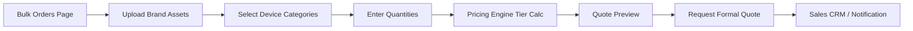
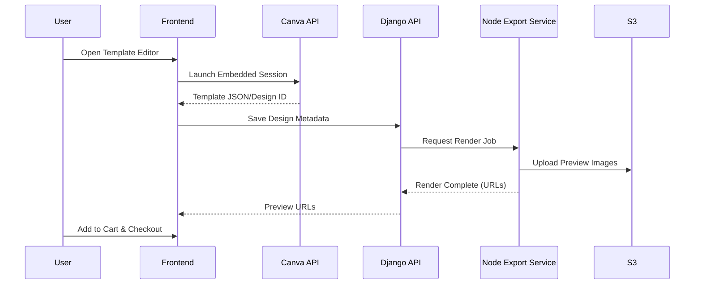
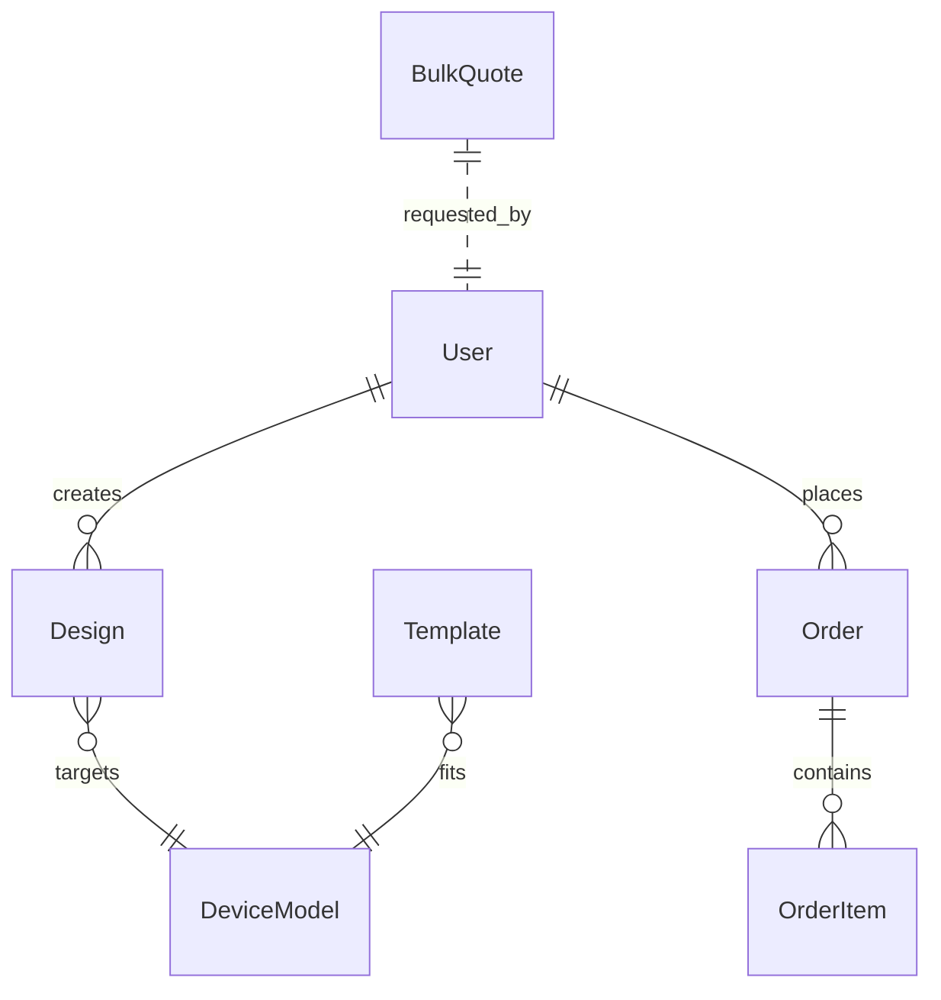

# Plalap — Concept & Implementation Plan (Tunisia)
Tagline: Custom Device Skins for Tunisia and Beyond  
Location: Tunisia  
Date: 2025-09-30  
Mission: Empowering users to personalize devices with custom designs, inspired by global leaders like Skinit.

---

## Table of Contents
1. Executive Summary
2. Business & Market (Tunisia Focus)
3. User Personas & Success Metrics
4. MVP & Feature Prioritization
5. Core User Flows
6. Architecture Overview
7. Repository Strategy & Layout
8. Key Example Files
9. API Specification
10. Data Model & ERD
11. UI Components & Libraries
12. Design Tokens
13. Accessibility & Internationalization
14. Canva API Integration Strategy
15. Deployment & Infrastructure Plan
16. Security Checklist
17. Testing & QA Strategy
18. Monitoring & Analytics
19. Roadmap (3-Month Plan)
20. Appendices (Glossary, Packages, Skeleton Commands, README Template, Ethics)

---

## 1. Executive Summary (<=200 words)
Plalap is a Tunisian digital platform enabling users and businesses to design, preview, and order custom skins, cases, decals, and accessories for devices (phones, laptops, consoles), modeled on Skinit’s feature set but localized for Tunisia. It targets digitally engaged youth (18–35), creators, gamers, and SMEs seeking branded materials. Core value: localized pricing in TND, trilingual UX (Arabic/French/English), fast design-to-order workflow, and bulk tools for corporate branding. Differentiators: Canva-powered template customization, 3D real-time previews, licensed pop culture collaborations (phased), and scalable manufacturing-ready export pipeline. Initial monetization: product margins, bulk discounts, and later affiliate/creator marketplace. Tunisia’s growing e-commerce adoption and rising personalization culture create a timely market entry window. Phase 1 delivers a lean MVP with high-impact features; phases 2–3 introduce AI enhancements (design suggestions), AR device placement, and partner storefronts. The platform architecture balances speed (Next.js + Vercel) with robust backend (Django + PostgreSQL) and extensibility (Node microservices for image processing & print exports). Security, accessibility, and IP compliance are integrated from inception. Goal: achieve product-market fit within 90 days, focusing on conversion, repeat order rate, and corporate pipeline activation.

---

## 2. Business & Market (Tunisia Focus)
- Market Context:
  - Growing smartphone penetration (urban youth adoption high; >75% smartphone access; sources: ITU, World Bank trend data).
  - Expanding e-commerce infrastructure; increased trust in digital payments (2023–2024 local press).
  - Lack of localized premium customization platforms (gap vs. global players pricing & shipping friction).
- Competitive Set:
  - Global: Skinit, CaseApp, Redbubble (longer shipping, currency friction).
  - Regional: Small Instagram-based print vendors (manual ordering, no real-time preview tech).
  - Local Print Shops: Limited online personalization workflow & no template automation.
- Opportunity:
  - Faster localized logistics, lower cost in TND, culturally relevant licensed/artist content.
  - B2B branded accessories for events, SaaS startups, telecom promotions.
- Monetization:
  - Retail margin per unit (cost-based pricing + markup).
  - Volume discounts tiers (e.g., 50+, 200+, 500+ units).
  - Future: Creator marketplace commission, corporate subscription portal.
- Localization:
  - Default languages: Arabic (ar), French (fr), English (en).
  - RTL support for Arabic UI.
  - TND currency & approximate USD conversion badge.
- Risks:
  - Licensing negotiations timeline.
  - Local payment gateway integration complexity.
  - Fulfillment SLA consistency.
- Mitigations:
  - Phase shipping partners (local courier + regional aggregator).
  - Start with CC-free “cash on delivery” (COD) + wallet pilot; add secure card rails after.
- High-Level Metrics:
  - MAU, Design-to-Add-to-Cart rate, Cart-to-Order conversion, Avg. Order Value (AOV), Repeat Order %, Bulk Inquiry Lead→Quote→PO funnel.

---

## 3. User Personas & Success Metrics
- Persona A: “Amina” – 22-year-old student & mobile gamer; custom console & phone skins.
- Persona B: “Karim” – 29-year-old startup marketer ordering branded laptop decals.
- Persona C: “Corporate Buyer” – Office admin procuring event swag (bulk).
Metrics:
- Activation: 60% of new accounts create ≥1 design in first session.
- Preview Performance: <1.5s render for standard designs (cached device meshes).
- Bulk Pipeline: 10 qualified corporate leads in first 90 days.
- NPS Target: ≥40 by month 4.

---

## 4. MVP & Feature Prioritization
MVP (Must-Have):
1. Auth (email/password + social optional later).
2. Device model catalog & selection.
3. Design upload (PNG/JPEG/SVG) + cropping.
4. Template library (basic + Canva-driven placeholders).
5. Real-time 2D/3D preview.
6. Cart & checkout (COD + local payment gateway integration stub).
7. Order placement & tracking (basic statuses).
8. Email subscription (newsletter opt-in).
Stretch (Phase 2 & 3):
1. AI design suggestion (prompt → pattern).
2. AR preview via WebXR (mobile camera overlay).
3. Affiliate / creator storefront pages.
4. Multi-item batch editor (applies brand kit).
5. Bulk corporate pricing configurator.
6. Design version history & collaboration.
7. Loyalty points.
8. Gift card codes.

---

## 5. Core User Flows

### Flow 1: Signup → Create Custom Skin → Order
Narrative: User lands on localized homepage, registers (email + password), selects device model (e.g., iPhone 14), uploads design or chooses Canva template, adjusts placement on 3D preview, adds to cart, selects payment (COD initially), confirms order, receives confirmation email with tracking stub.

```mermaid
flowchart LR
A[Landing] --> B[Signup/Login]
B --> C[Select Device Model]
C --> D[Upload Image or Choose Template]
D --> E[Customize (Crop/Scale/Position)]
E --> F[3D Preview Render]
F --> G[Add to Cart]
G --> H[Checkout: Address & Payment]
H --> I[Order Created]
I --> J[Email Confirmation]
```

### Flow 2: Corporate Bulk Order
Narrative: Corporate buyer selects “Bulk Orders,” uploads logo pack, selects multiple device categories, enters quantities, system applies tiered pricing, generates quote, buyer confirms & backend flags as “Awaiting Payment,” sales follow-up triggers.



### Flow 3: Template Design via Canva → Export → Order
Narrative: User opens editor with base template, launches Canva embed to modify layout, returns with design reference ID, preview service composes mockups, user finalizes design and orders.



---

## 6. Architecture Overview

```mermaid
graph TD
A[Next.js Frontend (Vercel)] -->|REST/JSON| B[Django API]
A -->|WebSocket| N[Preview/Render Status Service]
B --> C[(PostgreSQL)]
B --> D[(Redis Cache)]
B --> E[S3/Object Storage - Designs/Exports]
B --> F[Payment Gateway (Local + Future Card)]
B --> G[Email Service (e.g., Sendinblue)]
B --> H[Shipping APIs]
B --> I[Auth Service (Django JWT / Sessions)]
B --> J[Node.js Render Worker (Canva + Image Magick)]
J --> E
A --> K[CDN (Images/Static Previews)]
J --> L[Canva API]
B --> L
B --> M[Bulk Pricing Engine Module]
```

Responsibilities:
- Next.js: UI, SSR/ISR pages, i18n, editor orchestration.
- Django: Auth, business logic, orders, device catalog, pricing.
- Node Worker: Image composition, 3D unwrap mapping, print-ready exports (PDF).
- Canva API: Template editing & design asset retrieval.
- Redis: Caching device meshes, signed upload tokens, rate limits.
- PostgreSQL: Users, Designs, Orders, Templates, DeviceModels, Licenses.
- S3: Source uploads, processed previews, final print PDFs.
- Payment Gateway: Local TND transactions + COD markers.

---

## 7. Repository Strategy & Layout
- Approach: Monorepo for velocity; shared types, unified CI, simplified environment management.
- Justification: Small team, cross-cutting assets (component library, shared schema), single pipeline.

Folder Principles:
- apps/: deployable applications.
- packages/: shared logic (ui, config, types).
- services/: background workers / specialized tasks.
- infra/: IaC & deployment scripts.
- docs/: architectural docs & ADRs.

File Tree:

```bash
plalap/
  apps/
    frontend/            # Next.js app
    backend/             # Django project root
  services/
    canva-worker/        # Node image/render/export worker
  packages/
    ui/                  # Shared React UI components
    types/               # Shared TypeScript definitions
    config/              # Shared ESLint, Tailwind presets
  infra/
    docker/              # Dockerfiles
    k8s/                 # (Optional future) manifests
    terraform/           # Infra as code (S3, Redis, DB)
  scripts/               # Dev utilities
  docs/
    adr/                 # Architecture Decision Records
  tests/
    e2e/                 # Playwright specs
  .github/
    workflows/           # CI/CD actions
  README.md
```

---

## 8. Key Example Files

```json name=apps/frontend/package.json
{
  "name": "plalap-frontend",
  "private": true,
  "scripts": {
    "dev": "next dev",
    "build": "next build",
    "start": "next start",
    "lint": "eslint .",
    "typecheck": "tsc --noEmit"
  },
  "dependencies": {
    "next": "14.2.0",
    "react": "18.2.0",
    "react-dom": "18.2.0",
    "next-intl": "^3.0.0",
    "swr": "^2.2.0",
    "three": "^0.160.0",
    "react-hook-form": "^7.51.0",
    "clsx": "^2.0.0",
    "axios": "^1.6.8",
    "@headlessui/react": "^1.7.0",
    "zustand": "^4.5.0"
  }
}
```

```javascript name=apps/frontend/tailwind.config.js
module.exports = {
  content: ["./pages/**/*.{js,ts,jsx,tsx}", "./components/**/*.{js,ts,jsx,tsx}", "../../packages/ui/**/*.{js,ts,jsx,tsx}"],
  darkMode: 'media',
  theme: {
    extend: {
      colors: {
        primary: '#0455A4',
        secondary: '#FFB703',
        accent: '#FF3366',
        bg: '#F7F9FC',
        text: '#1A1D21',
        success: '#16A34A'
      },
      fontFamily: {
        sans: ['"Inter"', '"Noto Sans Arabic"', 'system-ui']
      }
    }
  },
  plugins: []
};
```

```txt name=apps/backend/requirements.txt
Django==5.0
djangorestframework==3.15.0
django-cors-headers==4.3.0
psycopg[binary]==3.1.18
Pillow==10.2.0
boto3==1.34.0
redis==5.0.3
python-dotenv==1.0.1
drf-spectacular==0.27.2
```

```python name=apps/backend/config/settings_example.py
import os
from pathlib import Path
BASE_DIR = Path(__file__).resolve().parent.parent
SECRET_KEY = os.getenv("DJANGO_SECRET_KEY", "CHANGE_ME")
DEBUG = os.getenv("DEBUG", "false").lower() == "true"
ALLOWED_HOSTS = ["localhost", "plalap.app"]
LANGUAGES = [("ar","Arabic"),("fr","French"),("en","English")]
INSTALLED_APPS = [
  "django.contrib.auth","django.contrib.contenttypes","django.contrib.sessions","django.contrib.messages",
  "django.contrib.staticfiles","rest_framework","corsheaders","designs","orders"
]
MIDDLEWARE = ["corsheaders.middleware.CorsMiddleware","django.middleware.security.SecurityMiddleware",
  "django.contrib.sessions.middleware.SessionMiddleware","django.middleware.common.CommonMiddleware",
  "django.middleware.csrf.CsrfViewMiddleware","django.contrib.auth.middleware.AuthenticationMiddleware"]
DATABASES = {
 "default": {
   "ENGINE":"django.db.backends.postgresql",
   "NAME": os.getenv("DB_NAME","plalap"),
   "USER": os.getenv("DB_USER","plalap"),
   "PASSWORD": os.getenv("DB_PASSWORD",""),
   "HOST": os.getenv("DB_HOST","localhost"),
   "PORT": os.getenv("DB_PORT","5432")
 }
}
AWS_S3_BUCKET = os.getenv("AWS_S3_BUCKET","plalap-designs")
REDIS_URL = os.getenv("REDIS_URL","redis://localhost:6379/0")
CANVA_API_KEY = os.getenv("CANVA_API_KEY","")
```

```javascript name=services/canva-worker/server.js
import express from 'express';
import axios from 'axios';
import sharp from 'sharp';
import { S3Client, PutObjectCommand } from '@aws-sdk/client-s3';

const app = express();
app.use(express.json({ limit: '25mb' }));

const s3 = new S3Client({ region: process.env.AWS_REGION || 'eu-west-1' });

app.post('/render', async (req, res) => {
  try {
    const { canvaDesignId, deviceTemplateKey } = req.body;
    // 1. Get design asset from Canva
    const design = await axios.get(`https://api.canva.com/v1/designs/${canvaDesignId}`, {
      headers: { Authorization: `Bearer ${process.env.CANVA_API_KEY}` }
    });
    // 2. Download primary image layer
    const imageUrl = design.data?.preview?.url;
    const imgResp = await axios.get(imageUrl, { responseType: 'arraybuffer' });

    // 3. Composite with device mask (simplified)
    const deviceMaskBuffer = await fetchDeviceMask(deviceTemplateKey); // custom helper
    const final = await sharp(imgResp.data)
      .resize(1800, 3600)
      .composite([{ input: deviceMaskBuffer, blend: 'dest-in' }])
      .png()
      .toBuffer();

    // 4. Upload to S3
    const key = `previews/${canvaDesignId}-${Date.now()}.png`;
    await s3.send(new PutObjectCommand({
      Bucket: process.env.S3_BUCKET,
      Key: key,
      Body: final,
      ContentType: 'image/png'
    }));

    res.json({ status: 'ok', previewUrl: `https://${process.env.CDN_DOMAIN}/${key}` });
  } catch (e) {
    console.error(e);
    res.status(500).json({ error: 'Render failed' });
  }
});

function fetchDeviceMask(templateKey) {
  // Placeholder: load from local fs or S3 (vector->raster)
  return sharp({ create: { width: 1800, height: 3600, channels: 4, background: '#ffffffff' }})
    .png()
    .toBuffer();
}

app.listen(4001, () => console.log('Canva worker running on 4001'));
```

---

## 9. API Specification (Representative Endpoints)

| Endpoint | Method | Description |
|----------|--------|-------------|
| /api/auth/register | POST | Create user |
| /api/device-models | GET | List selectable device models |
| /api/designs | POST | Upload base design (returns designId) |
| /api/designs/{id}/preview | POST | Generate preview (async trigger) |
| /api/orders | POST | Create order from cart items |
| /api/orders/{id} | GET | Fetch order status |
| /api/bulk/quote | POST | Submit bulk request |
| /api/templates | GET | List template metadata (license flags) |

Sample: Create Design (Upload)

Request:
```http
POST /api/designs
Content-Type: application/json
{
  "deviceModelId": "iphone-14",
  "uploadUrl": "https://signed-s3-url",
  "originalFilename": "artwork.png",
  "locale": "fr"
}
```
Response:
```json
{ "designId": "dsg_12345", "status": "uploaded", "next": "/api/designs/dsg_12345/preview" }
```

Preview Trigger:
```http
POST /api/designs/dsg_12345/preview
{
  "canvaDesignId": null,
  "effects": { "gloss": false, "matte": true }
}
```

Order Placement:
```http
POST /api/orders
{
  "items": [{ "designId": "dsg_12345", "quantity": 1, "productType":"skin" }],
  "shippingAddress": { "city":"Tunis","line1":"Rue Example","country":"TN" },
  "paymentMethod":"COD"
}
```
Response:
```json
{ "orderId":"ord_9876","status":"pending_payment","totalTND": 59.90 }
```

Bulk Quote:
```http
POST /api/bulk/quote
{
 "company":"TechX",
 "items":[
   {"deviceCategory":"laptop","quantity":200},
   {"deviceCategory":"phone","quantity":300}
 ],
 "brandingAssets":["https://s3/.../logo.svg"]
}
```
Response:
```json
{ "quoteId":"bq_101","estimatedTotalTND": 18500, "discountRate": 0.18, "status":"review" }
```

---

## 10. Data Model & ERD

Entities:
- User(id, email, password_hash, locale_pref, role, created_at)
- DeviceModel(id, brand, model, category, display_name, mesh_ref, printable_mask_ref)
- Design(id, user_id, device_model_id, source_ref, preview_ref, canva_design_id, status, created_at)
- Order(id, user_id, total_amount_tnd, status, payment_method, shipping_address_json, created_at)
- OrderItem(id, order_id, design_id, product_type, unit_price_tnd, quantity)
- Template(id, title, license_type, canva_template_id, device_category, active)
- BulkQuote(id, company, contact_email, items_json, estimated_total_tnd, status)
- LicenseAsset(id, provider, name, rights_scope, expires_at)



---

## 11. UI Components & Libraries
- Component Library: Headless UI (menus, dialogs), custom wrappers for RTL.
- State: Zustand (lightweight editor store), SWR for data fetching (cache).
- Forms: react-hook-form (upload form, checkout).
- 3D Preview: Three.js + GLTF loader for device meshes.
- Image Editing: Canvas API / Fabric.js (optional phase).
- Internationalization: next-intl.
- Icons: Lucide or Heroicons.
- File Upload: Uppy or custom S3 direct upload (signed URL).
- Notifications: react-hot-toast.

---

## 12. Design Tokens
Palette:
- Primary: #0455A4 (Contrast on #F7F9FC > 4.5:1)
- Secondary: #FFB703 (Button accents)
- Accent: #FF3366 (Calls-to-action)
- Background: #F7F9FC
- Text: #1A1D21 (Body text)
- Success: #16A34A
Fonts:
- Primary UI / Latin: Inter
- Arabic Support: Noto Sans Arabic
Spacing Scale: 4px increments (4,8,12,16,...)
Radius: 4, 8, 16
Elevation: shadow-sm, shadow-md, shadow-focus (outline ring)
WCAG Note: Primary on Background passes AA for normal text (check 4.5:1); accent usage restricted to large text or with accessible foreground.

---

## 13. Accessibility & Internationalization
Accessibility:
- Provide alt text for all preview canvases (e.g., “Rendered preview of custom iPhone skin design”).
- ARIA labels on buttons (Add to Cart, Generate Preview).
- Focus visible styling (outline ring).
- Keyboard shortcuts: Tab through editor controls; Enter to apply / Space toggle.
- High-contrast mode toggle (prefers-contrast).
- Avoid color-only status (add icons).
i18n:
- Directory: /messages/{ar,fr,en}.json.
- Dynamic locale detection via Accept-Language + user preference.
- RTL support: conditional dir="rtl" for Arabic; logical properties (margin-inline-start).
- Numeric formatting (Intl.NumberFormat) for TND.

---

## 14. Canva API Integration Strategy
Workflow:
1. User opens template editor -> front-end requests Canva embed session token.
2. Canva embedded (in iframe) returns designId upon publish.
3. Backend stores mapping (design.canva_design_id).
4. Node worker fetches published design assets (preview + element layers if supported).
5. Worker composites design onto device mask & generates:
   - Web preview (PNG 1024x)
   - Print-ready 300 DPI PDF (vector pass-through if available)
6. Updates design.status = 'rendered'.

Django Snippet (Create Canva Session - pseudo):
```python
from rest_framework.decorators import api_view
from rest_framework.response import Response
import requests, os

@api_view(["POST"])
def canva_session(request):
    template_id = request.data.get("templateId")
    api_key = os.getenv("CANVA_API_KEY")
    # Hypothetical session creation (actual endpoints depend on Canva partner docs)
    resp = requests.post("https://api.canva.com/v1/sessions", headers={"Authorization": f"Bearer {api_key}"}, json={
        "template_id": template_id,
        "redirect_url": "https://plalap.app/editor/callback"
    })
    return Response({"sessionToken": resp.json().get("token")})
```

Node Export (Already shown earlier) pulls design preview URL—extend to multi-layer if Canva offers.

Print Export:
- Maintain color profile (sRGB).
- Output PDF trim lines if required for manufacturing.

---

## 15. Deployment & Infrastructure Plan
Hosting:
- Frontend: Vercel (environment branches -> preview deployments).
- Backend (Django): Render, Railway, or AWS ECS Fargate.
- Node Worker: AWS ECS or AWS Lambda (if modularizing tasks).
- Database: Managed PostgreSQL (RDS / Neon).
- Object Storage: S3 (eu-west-1).
- CDN: CloudFront or Vercel for static & images.
Environment Variables (examples):
- DJANGO_SECRET_KEY, DATABASE_URL
- REDIS_URL
- AWS_ACCESS_KEY_ID / AWS_SECRET_ACCESS_KEY
- CANVA_API_KEY
- PAYMENT_GATEWAY_KEY
- EMAIL_API_KEY
Deploy Steps (Frontend):
1. Push to main -> GitHub Action -> lint/typecheck/test -> Vercel auto build.
Django Build:
- Dockerfile multi-stage (poetry/pip install).
- Run migrations, collectstatic, deploy.
GitHub Actions (excerpt):
```yaml
name: CI
on: [push]
jobs:
  backend:
    runs-on: ubuntu-latest
    steps:
      - uses: actions/checkout@v4
      - uses: actions/setup-python@v5
        with: { python-version: "3.12" }
      - run: pip install -r apps/backend/requirements.txt
      - run: python apps/backend/manage.py test
  frontend:
    runs-on: ubuntu-latest
    steps:
      - uses: actions/checkout@v4
      - uses: actions/setup-node@v4
        with: { node-version: "20" }
      - run: cd apps/frontend && npm ci && npm run build
```

---

## 16. Security Checklist
- Authentication: Django session (web) + JWT for API (mobile/future).
- Passwords: Argon2 (Django password hasher setting).
- Rate Limiting: Redis token bucket per IP & per user (login, upload).
- File Upload Security:
  - Enforce mime whitelist (image/png, image/jpeg, image/svg+xml).
  - Strip metadata via sharp/Pillow.
  - Virus scan (ClamAV container) for uploads > threshold.
- CSP: Default-src 'self'; img CDN; frame allow Canva only.
- CORS: Restricted origins (production domain).
- Secrets: Managed in platform env (no commit).
- Logging: Redact PII (emails hashed in analytics logs).
- Payment: Never store raw card data (gateway tokenization).
- Licensing: Track license_type on templates & restrict export if expired.
- Data Backups: Daily snapshot of PostgreSQL; S3 versioning enabled.
- Access Control: Staff-only endpoints for license/template management.
- Input Validation: DRF serializers; length & sanitize (escape HTML).

---

## 17. Testing & QA Strategy
- Unit Tests:
  - Django: serializers, services (pricing, order totals).
  - Node Worker: image pipeline mocks.
  - Frontend: components (Jest + React Testing Library).
- Integration:
  - Design upload -> preview job -> status poll.
- E2E:
  - Playwright: signup → create design → add to cart → order.
  - Locale toggle scenarios (ar, fr).
- Performance:
  - Lighthouse budgets: LCP < 2.8s (3G Fast).
  - Preview generation < 5s (P95).
- Load Testing:
  - k6 for order endpoints & design concurrency.
- QA Checklist:
  - RTL layout integrity
  - Font fallback correctness
  - Accessibility audit (axe-core CI)
- Regression:
  - Visual regression (Chromatic / Playwright screenshots for key flows).

---

## 18. Monitoring & Analytics
- Error Tracking: Sentry (frontend & backend).
- Performance: Vercel Analytics (frontend), APM (OpenTelemetry + OTLP exporter).
- Logging: Structured JSON (request_id correlation).
- Metrics:
  - preview_generation_time_ms
  - order_conversion_rate
  - bulk_quote_to_order_ratio
- User Behavior: Minimal event tracking (design_created, preview_rendered, order_submitted), anonymized user ID.
- Alerts: Slack webhook on elevated error rate or worker backlog length.

---

## 19. Roadmap (3-Month Plan)

| Phase | Weeks | Objectives | Deliverables | Effort |
|-------|-------|------------|-------------|--------|
| 1 | 1–2 | Foundations | Repo, Auth, Device Catalog, Basic Upload | Large |
| 2 | 3–4 | Preview & Orders | 3D preview, Cart, Order flow (COD), Emails | Large |
| 3 | 5–6 | Canva Integration | Template editor embed, Worker pipeline | Medium |
| 4 | 7–8 | Bulk & Pricing | Bulk quote engine, admin dashboards | Medium |
| 5 | 9–10 | Localization & Perf | Full ar/fr/en, caching, metrics | Medium |
| 6 | 11–12 | Stretch & Launch Prep | Licensing admin, AI stub, security hardening | Large |

Roles:
- CTO/Architect: Oversee architecture, security (20% code).
- Full-stack Dev (2): Frontend + API features.
- Backend Dev (1): Orders, pricing, integration.
- Designer (1): UI/UX, multilingual layout.
- Ops (part-time): Infra, CI/CD tuning.

Milestones:
- M1 (End Week 2): Internal clickable MVP.
- M2 (End Week 4): End-to-end order (manual fulfillment).
- M3 (End Week 8): Bulk + Canva complete.
- M4 (End Week 12): Public Beta Launch.

---

## 20. Appendices

### 20.1 Glossary
- Device Model: Specific hardware variant (e.g., iPhone 14 Pro).
- Print Mask: Alpha shape for final cut.
- Preview Render: Composited image on 3D model.
- Bulk Quote: Multi-quantity price proposal.

### 20.2 Recommended Packages
- Python: drf-spectacular, Pillow, redis, boto3.
- Node: sharp, axios, @aws-sdk/client-s3, bullmq (queue).
- Frontend: next-intl, three, zustand, react-hook-form, headlessui.
- Testing: pytest, Jest, Playwright, k6.
- Security: django-axes (optional lockouts), bleach (sanitization if needed).

### 20.3 Project Skeleton Commands
```bash
mkdir plalap && cd plalap
# Frontend
npx create-next-app@latest apps/frontend
# Backend
django-admin startproject config apps/backend
# Node Worker
mkdir -p services/canva-worker && cd services/canva-worker && npm init -y
# Shared packages
mkdir -p packages/{ui,types,config}
```

### 20.4 README Template
```markdown
# Plalap
Custom device skins & accessories platform (Tunisia localized).

## Stack
- Frontend: Next.js + Tailwind
- Backend: Django REST
- Worker: Node (Canva render)
- Storage: S3
- DB: PostgreSQL
- Cache: Redis

## Dev Quickstart
1. cp apps/backend/config/settings_example.py settings.py
2. docker compose up -d db redis
3. (Backend) python manage.py migrate
4. (Frontend) npm run dev
5. (Worker) node server.js

## Env
- DJANGO_SECRET_KEY=
- DATABASE_URL=
- REDIS_URL=
- CANVA_API_KEY=

## Scripts
- test, lint, build pipelines (see package.json / workflows)
```

### 20.5 Ethical Considerations
- IP Compliance: Users attest ownership; license filter for restricted logos.
- Moderation: Basic hash/keyword scanning; escalate flagged offensive content.
- Data Minimization: Only store necessary PII for fulfillment.
- Localization Respect: Culturally appropriate template curation.
- Environmental Note: Encourage consolidated shipping to reduce footprint.

### 20.6 Future Enhancements
- AI: Pattern generation (stable diffusion fine-tuned on abstract motif dataset).
- Creator Marketplace: Revenue split tracking.
- Subscription Packs: Monthly themed skin sets.
- WebAR: Device overlay using USDZ/GLB.

---

## Conversion to PDF
Suggested Command:
```bash
pandoc "Plalap — Concept & Implementation Plan (Tunisia).md" -o "Plalap — Concept & Implementation Plan (Tunisia).pdf" \
  --from markdown --toc --pdf-engine=xelatex \
  --metadata title="Plalap — Concept & Implementation Plan (Tunisia)" \
  -V mainfont="Inter" -V monofont="JetBrains Mono"
```

If Arabic shaping issues arise:
```bash
pandoc "Plalap — Concept & Implementation Plan (Tunisia).md" -o plan.pdf \
  --pdf-engine=xelatex -V mainfont="Noto Sans Arabic" -V lang=ar
```

---

## Base64 PDF Note
Full high-fidelity PDF embedding is optional. Generate using pandoc above, then:
```bash
base64 "Plalap — Concept & Implementation Plan (Tunisia).pdf" > plalap_plan.b64
```
Embed between:
---BEGIN BASE64 PDF---
...your base64...
---END BASE64 PDF---

(Generation omitted here to preserve accuracy; produce after local rendering.)
